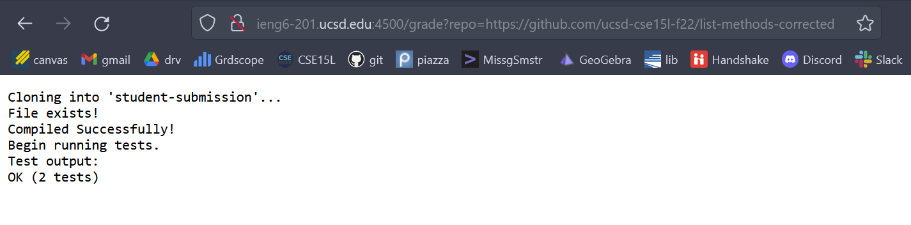

# Lab Report 5

## 1. grade.sh code
```
CPATH=".;lib/hamcrest-core-1.3.jar;lib/junit-4.13.2.jar"
rm -rf student-submission
git clone $1 student-submission
cp -r lib student-submission

if [ -e student-submission/ListExamples.java ]; then
    cp TestListExamples.java student-submission
    cd student-submission
    echo "copied TestListExamples.java"
else
    echo "file doesn't exist"
    exit 1
fi

javac -cp $CPATH *.java
if [ $? -eq 0 ]; then
    echo "Compiled."
else
    echo "Failed to compile..."
    echo $?
    exit 1
fi

echo "Running tests..."
java -cp $CPATH org.junit.runner.JUnitCore TestListExamples > testout.txt
echo "Test output:"
grep -i "test" testout.txt
```
---
## 2. Result from three submissions

**My code doesn't work for the browser interface because of the naming error I mentioned in [this piazza post](https://piazza.com/class/l7pbb88wlepvh/post/598). I've tried (1)changing CPATH to the linux format and running in ieng, and (2)[this stack exchange post](https://unix.stackexchange.com/questions/391223/why-am-i-getting-line-1-r-command-not-found), but none of them worked. The following report is based on running `bash grade.sh <repo link>` in my local terminal.**

- First repo
     
- Second repo
    
- Third repo
    
---

## 3. Trace of the 2nd screenshot. 
We will store all standard output in the format `<command>.out.txt`, and all standard error in the format `<command>.err.txt`. 

(1)
```
CPATH=".;lib/hamcrest-core-1.3.jar;lib/junit-4.13.2.jar"
rm -rf student-submission > rm.out.txt  2> rm.err.txt
git clone $1 student-submission > clone.out.txt 2> clone.err.txt
cp -r lib student-submission > cp.out.txt 2> cp.err.txt
```
clone.err has `Cloning into 'student-submission'...'`, all other stdout and stderr are empty.

(2)
```
if [ -e student-submission/ListExamples.java ]; then
    cp TestListExamples.java student-submission > cp.out.txt 2> cp.err.txt
    cd student-submission
    echo "copied TestListExamples.java"
else
    echo "file doesn't exist"
    exit 1
fi
```
The first if statement is *True* because the java file exists in the student-submission folder. Both cp.out and cp.err are empty. The else part is not run.

(3)
```
javac -cp $CPATH *.java > javac.out.txt 2> javac.err.txt
if [ $? -eq 0 ]; then
    echo "Compiled."
else
    echo "Failed to compile..."
    echo $?
    exit 1
fi
```
 The if statement is *True* and both javac.out and javac.err are empty, because the file compiled successfully, and the exit code was 0. The else part is not run.

(4)
```
echo "Running tests..."
java -cp $CPATH org.junit.runner.JUnitCore TestListExamples > testout.txt 2> testerr.txt
echo "Test output:"
grep -i "test" testout.txt > grepout.txt 2>greperr.txt
```
grepout is "OK (2 tests)", and testout is 
    `JUnit version 4.13.2
    ..
    Time: 0.028
    OK (2 tests)`.

All other stdout and stderr are empty. This is because the tests run successfully with exit code 0 and we can find "test" in the JUnit output. 