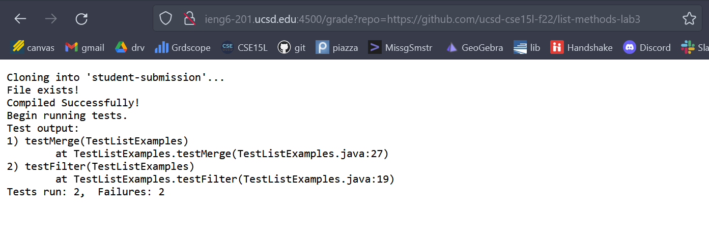

# Lab Report 5: Autograder

## 1. grade.sh code
```
CPATH=".:../lib/hamcrest-core-1.3.jar:../lib/junit-4.13.2.jar"

rm -rf student-submission
git clone $1 student-submission
cp TestListExamples.java student-submission/

if [[ -e student-submission/ListExamples.java ]]
then
    echo "File exists!"
else
    echo "File not found. Please try again."
    exit 1
fi

cd student-submission

javac -cp $CPATH *.java 
if [ $? -eq 0 ]; then
    echo "Compiled Successfully!"
else
    echo "Failed to compile. Please try again."
    exit 1
fi

echo "Begin running tests."

java -cp $CPATH org.junit.runner.JUnitCore TestListExamples > testout.txt
echo "Test output:"
grep -i "test" testout.txt 
```
---
## 2. Result from three submissions

**I encountered the naming error [as described in this piazza post](https://piazza.com/class/l7pbb88wlepvh/post/598) when submitting the report the first time. After following [this article suggested by prof. Politz](https://medium.com/@csmunuku/windows-and-linux-eol-sequence-configure-vs-code-and-git-37be98ef71df) to change the EOL, and cloning the repo to run in ieng6 server, I can successfully run the grader in the browser.**

- First repo
     
- Second repo
    
- Third repo
    
---

## 3. Trace of the 2nd screenshot. 
We will store all standard output in the format `<command>.out.txt`, and all standard error in the format `<command>.err.txt`. 

(1)
```
CPATH=".:../lib/hamcrest-core-1.3.jar:../lib/junit-4.13.2.jar"
rm -rf student-submission > rm.out.txt 2> rm.err.txt
git clone $1 student-submission > clone.out.txt 2> clone.err.txt
cp TestListExamples.java student-submission/ > cp.out.txt 2> cp.err.txt
```
All stdout and stderr are empty and the exit codes should be 0. 

(2)
```
if [[ -e student-submission/ListExamples.java ]]
then
    echo "File exists!"
else
    echo "File not found. Please try again."
    exit 1
fi
```
The first if statement is *True* because the java file exists in the student-submission folder. The else part is not run.

(3)
```
cd student-submission

javac -cp $CPATH *.java > javac.out.txt 2> javac.err.txt
if [ $? -eq 0 ]; then
    echo "Compiled Successfully!"
else
    echo "Failed to compile. Please try again."
    exit 1
fi
```
 The if statement is *True* and both javac.out and javac.err are empty, because the file compiled successfully, and the exit code was 0. The else part is not run.

(4)
```
echo "Begin running tests."

java -cp $CPATH org.junit.runner.JUnitCore TestListExamples > testout.txt 2> testerr.txt
echo "Test output:"
grep -i "test" testout.txt  > grepout.txt 2>greperr.txt
```
grepout is "OK (2 tests)", and testout is 
    `JUnit version 4.13.2
    ..
    Time: 0.01
    OK (2 tests)`.

All other stdout and stderr are empty. This is because the tests run successfully with exit code 0 and we can find "test" in the JUnit output. 

---